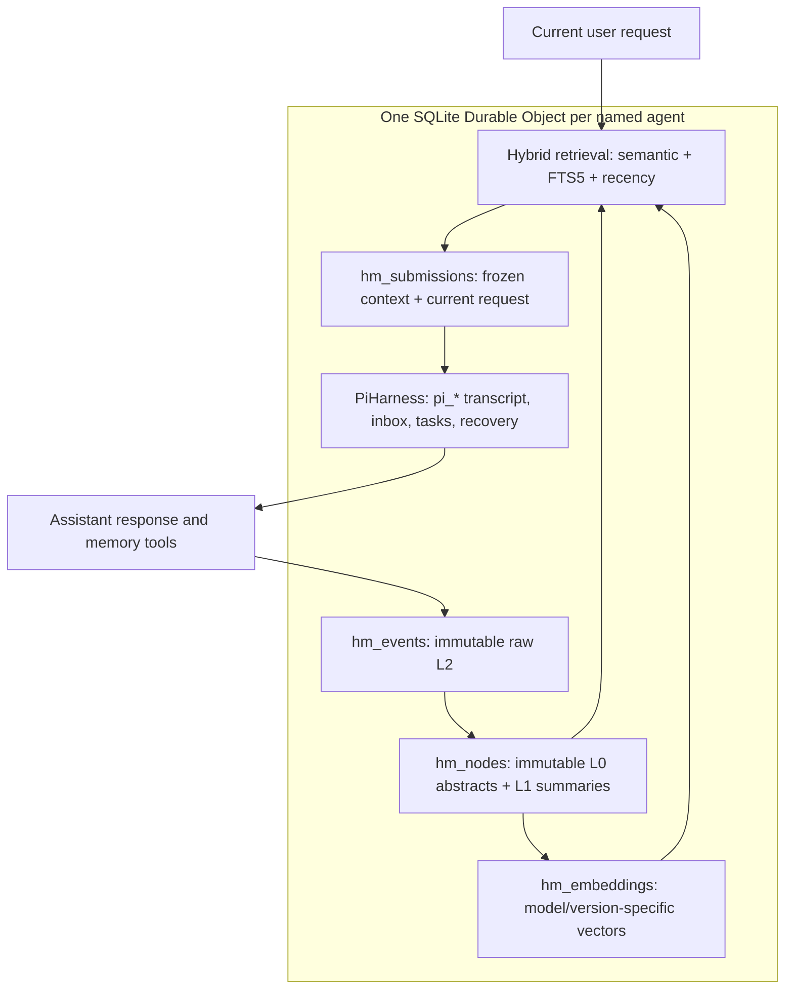

# Durable Agent Memory

A TypeScript long-term memory engine for SQLite-backed Cloudflare Durable Objects, with a working integration with the beta **PiHarness** API. MIT licensed.

**Deployed demo:** <https://durable-agent-memory.cloudflare-henry.workers.dev> (data APIs require the demo token).

**Pi transcript ≠ long-term memory ≠ retrieved working context.**

- **Pi Durable** retains the exact active transcript, inbox, task graph and model loop, and recovers interrupted work.
- **Hybrid Memory** retains immutable events and incremental binary summary trees, plus replaceable embedding indexes.
- **Working context** contains selected evidence under a budget. The demo freezes it into a new submitted turn immediately before the user's request.

**Memory writes are append-only storage operations; they do not rewrite the active context prefix.** Ordinary Pi turns retain existing messages and append new ones. This preserves the opportunity for provider prefix/KV-cache reuse; the provider decides whether it actually caches.



## Quick start

Requires Node **22.13+** (tested on 22.23.2), npm, and a Cloudflare account with Workers AI and SQLite Durable Objects enabled. Dependencies are locked: `agents` 0.26.0, `@earendil-works/pi-durable` 1.0.2, `@earendil-works/pi-ai` 1.0.2.

```bash
npm ci
npm run check
npm run test:recovery
npm run test:workspace
npx tsx examples/independent.ts
```

Run the local inspection demo without credentials:

```bash
npm run dev -- --local --var LOCAL_TEST:true --var DEMO_TOKEN:local-testing-only
```

Open <http://localhost:8787>, enter `local-testing-only` as the API token, and use the buttons to inspect memories. **LOCAL_TEST uses extractive summaries, lexical search and a scripted Pi model.** It exercises the real PiHarness and Durable Object persistence but performs no LLM inference or semantic embeddings. Unit tests use an explicit vector fixture to test semantic scoring. Production uses Workers AI; there is no silent fake-provider fallback.

In another terminal:

```bash
DEMO_TOKEN=local-testing-only npm run smoke
```

The smoke test writes a SQLite preference, adds a vision-routing decision followed by 15 other events in its namespace, verifies the binary tree and progressive expansion, chats with Pi, checks that an independent memory write leaves the Pi transcript unchanged, then resets the context and recalls the preference again. The UI's **Inspect all** response shows every event, node, child relationship, L0/L1 representation, embedding model/version, active transcript and cache epoch. Search and chat responses expose scores and selected context. Read an event for L2, or expand a node to its direct children.

## Connect T3 Code

A local executable now bridges T3's Pi JSONL RPC to this deployed **Pi Durable** harness. It supports streamed chat, memory tools, isolated/resumable sessions and cancellation. The hosted harness also provides a persistent remote `/workspace` and bounded page fetching. An optional Workers Paid configuration enables tested sandboxed JavaScript execution. It does not access the T3 host’s files, shell or injected MCP extensions. See [execution capabilities](docs/EXECUTION.md).

```bash
npm run build:bridge
npm run test:bridge
```

Configure a private endpoint/token-file config, then point T3's Pi binary setting at `bin/pi-durable`. See [T3 setup, protocol and compatibility](docs/T3-BRIDGE.md) before connecting. Unsupported full-CLI features fail explicitly.

## Independent engine

```ts
import { HybridMemory } from './src/core/memory';
import { openNodeMemory } from './src/storage/node-sqlite';

const database = openNodeMemory('agent.sqlite');
const memory = new HybridMemory({ store: database.store });

const event = await memory.remember({
  content: 'My favourite database for small projects is SQLite.',
  kind: 'preference', namespace: 'preferences',
  idempotencyKey: 'preference-import-1',
});
await memory.compact(); // finish pending summary/index work
const hits = await memory.search({ query: 'database', namespaces: ['preferences'] });
const context = await memory.context({ query: 'Which database?', maxTokens: 4000 });
const source = await memory.read(event.id); // lossless L2
const children = await memory.expand(hits[0].id); // direct children; leaves expand to L2

database.close();
```

The default independent engine has extractive summaries and lexical retrieval. Supply an `EmbeddingProvider` for semantic retrieval and a `MemorySummarizer` for model-generated summaries. The deployed adapter supplies both using Workers AI. `TokenCounter` and scoring are also injectable. TypeScript source exports are intended for a TS-aware bundler or `tsx`; this repository is not yet published to npm.

`remember()` validates and commits an event without waiting for model work. An optional idempotency key makes tool replay and imports safe; reusing a key with different input fails. `compact()` finishes missing work, without regenerating historical nodes. Background jobs use bounded batches of eight. Summary errors retain sources and missing work for retry.

Namespaces are optional (stored as `""`) and filters match exact namespace names. Kinds are `observation`, `preference`, `decision`, `fact`, `episode`, `outcome`, `error`, and `instruction`. A stored `instruction` is historical data, not elevated system authority.

## Pi integration and cache locality

The integration uses documented SDK APIs: `PiHarness`, `Harness.open`, the registry's extensions and tools, `CompactionTask.beforeCompact`, and session `reset()`.

```text
stable system instructions and stable tools
existing Pi transcript, including previously frozen retrieval
...
newly retrieved memory evidence (frozen once per operation)
current user request
```

Pi exposes a `GenerationTask.beforeRequest` hook that can replace one request's messages. This project deliberately avoids transient dynamic retrieval there: that retrieval would disappear from the next transcript-derived request, changing its historical prefix. Instead, `prepareTurn()` uses the public `UserInput` text-block API to submit retrieved evidence followed by the actual request, in one durable `pi.user` entry. A frozen snapshot in `hm_submissions` makes operation retries reuse identical bytes. **No memory content is rendered by a dynamic system-prompt section.**

The `remember`, `recall`, and `memory_expand` tools use Pi's public tool API. Remember writes use the Pi conversation/call id as a replay key. Tool results enter the ordinary append-only transcript. External direct calls to `harness.prompt()` bypass automatic host retrieval, but the tools remain available; use `prepareTurn()` for automatic retrieval.

Before automatic Pi compaction, the hook retains the selected transcript range as immutable episode events and finishes pending memory summaries; Pi then makes and places its own compaction. The demo's **New cache epoch** endpoint retains the active transcript, finishes work, builds a budgeted handoff, and calls public session `reset()`. Original transcript records and raw events remain durable. Ordinary memory writes do not trigger reset or compaction.

See [ARCHITECTURE.md](ARCHITECTURE.md) for contracts, decisions, scaling limits and rejected approaches.

## Cloudflare deployment

```bash
npx wrangler whoami
# If needed: npx wrangler login
# Multiple accounts: set CLOUDFLARE_ACCOUNT_ID in your process environment.
npx wrangler secret put DEMO_TOKEN
npm run deploy
```

Enter a random token through Wrangler's secret prompt. Store it in your password manager. No provider API key is needed for the `AI` binding. `wrangler.jsonc` declares a `new_sqlite_classes` migration and the `AI` binding. Do not deploy with `LOCAL_TEST=true`. The default model is `@cf/zai-org/glm-4.7-flash`; update `MODEL` only to a model listed by the current Agents Workers AI provider catalog.

The deployment created from this workspace keeps its demo token in `/home/coder/.config/durable-agent-memory/demo-token` (mode 0600), outside the repository. Use it in the inspection UI; it is separate from your Cloudflare API token.

The root inspection UI and `/health` are public; **all memory, chat and debug APIs require `Authorization: Bearer <DEMO_TOKEN>`**. Without the secret, these APIs fail closed. This is a developer demo with one shared token, not a multi-user access-control system. Named agent ids select isolated Durable Objects, but every holder of the shared token can access every named agent.

Run the remote smoke test without placing the secret in shell history:

```bash
read -rs DEMO_TOKEN; export DEMO_TOKEN; echo
DEMO_URL=https://YOUR-WORKER.YOUR-SUBDOMAIN.workers.dev npm run smoke
unset DEMO_TOKEN
```

To verify hosted persistence, set `DEMO_URL`, `DEMO_TOKEN`, and `DEMO_AGENT` to an existing smoke-tested agent, then run `npm run test:remote-recovery` with your Cloudflare credentials exported. It redeploys the Worker, requires a changed Durable Object `bootId`, and compares exact events, nodes, transcript and epochs.

Watch errors in another terminal with `npx wrangler tail --format json`. Logs use subsystem markers (`hm_request_failed`, `hm_summary_retry`, `pi_report`); they do not print submitted memory or provider output. In deployed mode the smoke test also verifies persisted Workers AI vectors and semantic retrieval. Model calls incur Workers AI charges. Remote verification must be done on a successfully authenticated deployment; local tests do not prove account permissions or hosted model availability.

If device login returns an HTML/browser challenge, use browser OAuth instead: forward TCP port 8976 from the development host to your computer (`ssh -N -L 8976:127.0.0.1:8976 coder@YOUR_DEV_HOST`), run `wrangler login --browser=false` on the host, and open its link on your computer. Do not paste credentials into chat or commit `.env` files.

### HTTP API

Every API lives at `/api/:agent/:action`; agent names contain 1–64 letters, digits, `_` or `-`.

| Method/action | Body or query | Result |
| --- | --- | --- |
| POST `remember` | `RememberInput` | Durable event; queues summary work |
| POST `search` | `{query, namespaces?, kinds?, limit?, weights?, includeRecent?}` | Ranked L0 hits, signals and provenance |
| POST `context` | Search input + `maxTokens` | Selected evidence and full rendered-budget count |
| GET `read` | `?id=...` | L1 summary node or L2 event |
| GET `expand` | `?id=...` | Direct children; recursively expand for raw sources |
| POST `compact` | `{}` | Finish missing summary/vector work |
| POST `chat` | `{message, operationId?}` | Pi answer/transcript and frozen retrieval |
| POST `reset` | `{query?}` | Retain transcript, summarize, new context with handoff |
| GET `debug` | — | Events, nodes, embedding versions, pending work, transcript, epochs |

Use a unique stable `operationId` per chat request for retry safety. `chat` waits for the result; the underlying Pi submission is durable. A timed-out client can retry with the same operation id. This small demo does not expose streaming or a separate inbox-status API.

## Inspiration and status

**OptMem-inspired:** immutable hierarchical compression, completed binary ranges, preserved audit trail. The tree is a retrieval/compression structure; its chronological wake output is not a mutable system-prompt block.

**OpenViking-inspired:** inexpensive L0 discovery, L1 summaries, L2 retained sources, explicit progressive expansion and hybrid scores.

**Pi Durable integration:** actual SDK-backed transcript, model loop, inbox/tasks and lifecycle recovery. OptMem and OpenViking APIs/CLIs are not implemented, and no compatibility with those products is claimed.

This is an inspectable v1. Before production: add per-user authorization and quotas, pagination/retention policy, realistic retrieval/summary quality evaluation, exact model tokenizer integration, durable export/backup workflows, and large-corpus indexing. Exercise provider failures and eviction during live tools against the target Cloudflare account. PiHarness remains beta; pin dependencies and re-run prefix/recovery tests when upgrading.
