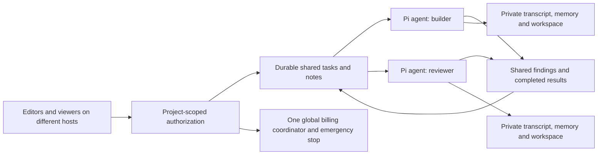

# Shared projects, people and agents

Open [shared projects](https://durable-agent-memory.cloudflare-henry.workers.dev/multiplayer). The owner creates a project, adds named agents and issues an editor or viewer credential to each person/host. Editors publish notes and create/dispatch tasks; viewers observe agents and results. Different agents run independently. Each new shared turn records its authenticated submitting member; a different member cannot reuse the same operation ID. Pi serializes inputs within one agent's durable inbox. Each agent owns its exact transcript, hierarchical long-term memory and virtual filesystem.

The shared project board is durable coordination data, not a rewritten system prompt. Agents use `team_board` to inspect work and `team_note` to publish findings/handoffs. A bounded project snapshot is frozen at the tail of each new user/task submission alongside retrieved private memory. A retry keeps the original snapshot bytes even if other people publish new notes. Existing transcript entries never change because a note or memory is written.



## Start a team

1. Enter the existing **owner demo token** on `/multiplayer`. Create a project and add agents such as `builder` and `reviewer` with concise purposes. The purpose is contextual evidence at the tail; it does not grant tool permissions or rewrite their system instructions.
2. Issue editor/viewer tokens in Owner setup. The newly generated token is displayed once. Store it in a private mode-0600 file on the corresponding host and share through your normal private credential channel. Never use the Cloudflare API token as a project credential or commit project credentials.
3. Create a task for the builder and click **run**. Click **observe** for a bounded SSE view, or **refresh** to reconcile its durable Pi result. Publish useful notes with `team_note` or the project UI.
4. Dispatch review work on the reviewer. It can inspect `team_board` and use completed task results and notes. Independent tasks can run concurrently on different agents. Each agent has a separate private workspace; published file paths are references, not shared file access.
5. Cancel an individual task with **cancel**. It targets that operation rather than aborting unrelated queued work. The owner can stop every project from the prominent emergency controls on the main page.

There is no recurring polling, automatic task dispatch, recursive autonomous fan-out or surprise background model loop. Creating a task queues coordination data; pressing run admits exactly one Pi turn. Task dispatch can be deliberately resubmitted once with the same operation ID to recover an ambiguous network/crash outcome. No second inference is created for an already admitted operation. After two dispatch attempts, inspect/refresh/cancel rather than resubmitting indefinitely. Failed/terminal tasks are immutable outcomes; create a new task id for new work.

## T3 on different hosts

Build the same `bin/pi-durable` bridge on each T3 host. In that host's private bridge config, set `agentId` to the project agent id shown on the board, and `tokenFile` to its project editor token:

```json
{
  "url": "https://durable-agent-memory.cloudflare-henry.workers.dev",
  "agentId": "mp-REPLACE-WITH-THE-AGENT-UUID",
  "tokenFile": "/absolute/private/project-editor-token",
  "sessionsDir": "/absolute/private/project-bridge-sessions"
}
```

The bridge is pinned to that shared agent; `new_session` is rejected rather than silently creating an unauthorized unrelated object. Each client keeps its own private resume manifest. Configure a different agent/config for a separate project agent. Multiple hosts observing/submitting to the same agent share its transcript and serialized Pi inbox. They do not share local manifest files. The bridge still rejects concurrent commands in its own process; the project UI supports observation without being a writer. T3's binary override still advertises ordinary Pi CLI capabilities; see [T3 compatibility boundaries](T3-BRIDGE.md).

## API

All endpoints use bearer authorization. Only the owner may create projects, manage credentials and add agents.

| Endpoint | Method | Body / behavior |
|---|---|---|
| `/admin/projects` | GET / POST | List / create `{project,title}` |
| `/projects/:project/board` | GET | Bounded shared agents, members, latest 20 tasks/notes; no credential hashes |
| `/projects/:project/members` | POST | Owner issues `{id,label,role:"editor"\|"viewer"}`; token returned once |
| `/projects/:project/revoke` | POST | Owner revokes `{id}` as returned in member record |
| `/projects/:project/agents` | POST | Owner adds `{label,purpose,allowedTools?}` |
| `/projects/:project/notes` | POST | Editor appends `{id,content}` |
| `/projects/:project/tasks` | POST | Editor creates `{id,agent,instruction}` |
| `/projects/:project/run` | POST | Editor dispatches `{id}`; returns durable operation receipt |
| `/projects/:project/refresh` | POST | Reconcile `{id}` against actual Pi outcome; viewer may observe reconciliation |
| `/projects/:project/cancel` | POST | Editor cancels `{id}` |
| `/api/:agent/...` | Existing API | Project token can access only its assigned project's agents; viewers restricted to read RPCs and GET |

The public Worker accepts only named fields; clients cannot supply owner/internal-agent authority. Hashes of high-entropy credentials live in SQLite; plaintext tokens are not stored. Revocation remains available to the owner even while globally stopped; it performs a bounded coordinator-row update and creates no inference. Revocation blocks subsequent requests; an already connected stream ends within its existing 120-second bound. Owner credentials retain access to legacy standalone agent sessions. Project credentials cannot operate global stop/resume or inspect another project's agents.

## Bounds, recovery and security

The existing singleton `BillingControl` also owns `mp_*` coordination tables. No new namespace or paid service is created. At most ten projects, eight issued credentials (including revoked) and four agents per project; 100 retained tasks/notes per project. Existing lifetime 50 admitted agent objects and global daily/monthly limits still apply across all projects. Dispatch reserves conservative frozen-input storage before contacting Pi; every model/tool/embedding remains gated. Metadata writes reserve storage too. Project contexts cap at 6000 UTF-8 bytes. Individual task/note text and result sizes are bounded.

SQLite transactions claim tasks and prevent two different tasks from simultaneously owning the same agent. A task's operation identity survives coordinator/agent restart. Reconciliation waits at most 250ms and creates no inference. Lost dispatch responses recover through the same frozen submission; two attempts maximum. Stop preserves data and counters, disables further project work, and requests cancellation of registered agents. Owner stop/status/resume remains reachable while quotas are exhausted.

This is scoped bearer access, not an identity provider, SSO or a tenant-specific billing contract. Agent assignments may include an immutable `allowedTools` list. The default enables existing tools; for a review-only agent use `["team_board", "read", "recall", "memory_expand"]`. Enforcement occurs before effects without changing static tool declarations. This policy restricts model tool execution, not the human editor API. Editor access includes destructive actions within that project (e.g. reset/delete through agent tools); give viewer access for observation. Current filesystem and retained memory are private per agent, with explicit project handoffs. This avoids concurrent file overwrite; a shared Git repository requires isolated worktrees, conflict handling, permissions and a separately selected shell execution service. The current JavaScript sandbox is not a Linux coding container.

Local validation: `npm run check`, `npm run test:multiplayer`, workspace/recovery and T3 bridge tests. Multiplayer smoke runs real workerd and official Pi with a scripted fixture, not paid AI. It covers parallel agents, shared handoffs, scope/revocation, viewer denial, prefix preservation, restart and emergency controls. Local tests cannot prove every hosted eviction scenario.
