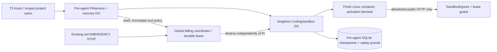

# Cloudflare Linux coding sandbox: activation blocked

**Activation is blocked even with cost confirmation.** Official native API documentation states that under `durable_object` scheduling, all exec processes have root capabilities regardless of user; file permissions do not enforce isolation. The non-root Docker test does not establish deployed isolation. A documented redesign (for example, default scheduling with actual non-root permissions and platform concurrency limits) is required before activation.

The deployed multiplayer system currently has persistent JavaScript/VFS execution. This opt-in implementation adds a Linux shell with Node/npm, Python3 and Git on **Cloudflare Containers**, controlled through the current native Durable Object Container API. It has not been deployed or verified on the Cloudflare Container transport. Activating a new paid application requires the owner's separate cost approval. Nothing in the normal `npm run deploy` enables it.

## Architecture and tools



Agents collaborate through existing tasks and `team_note`/`team_board`. Their Linux files and Git checkouts remain private, indexed by centrally admitted agent identity. A single named sandbox object (`project-coding-v1`) serves all agents, one at a time; concurrent shell requests fail without queued execution or automatic retries. No model is started by sandbox admission. Existing member credentials and viewer/editor roles are unchanged; project `allowedTools` must include `shell`. Existing agent tool assignments are immutable: create a new shell-enabled agent rather than silently broadening an old agent.

The Pi tool is **`shell`**, not `exec`. `exec` and the existing `read/write/edit` tools still address the independent JavaScript VFS; use shell commands for Linux file operations. T3 continues to connect through the same Pi bridge and authenticated Cloudflare URL. Its provider must display/forward Pi tool calls; the bridge does not run commands on a T3 host.

For example, after activation:

```json
{"command":"printf 'console.log(6 * 7)\\n' > main.js; node main.js; git init -q .; git add main.js; git status --short","timeoutMs":20000}
```

A completed response includes `exitCode`, `stdout`, `stderr`, and **`checkpointed`**. Nonzero exits and failed checkpoints are tool errors. A failed checkpoint retains the previous durable snapshot; changes from that execution disappear on destruction. Do not claim a durable file effect unless `checkpointed` is true. No automatic replay of interrupted effects is permitted; Pi uses unsafe replay policy and a durable Pi task/call-id journal returns finished results without new execution.

## Reviewed proposed limits and cost estimate

| Resource | Limit |
| --- | --- |
| Container size | lite: 1/16 vCPU, 256 MiB memory, 2 GB provisioned disk |
| Global concurrency | 1, across all projects/agents |
| Reserved runtime | 90 seconds per attempt; 270/day, 900/month |
| Attempts | At most 3/day and 10/month via fixed runtime reservation |
| Other admission | Existing execution/tool/storage quotas also apply, without increases |
| Source checkpoint | 2 MiB raw, 512 files, 2.8 MB serialized, private per agent |
| Storage reservation | 6 MiB per attempt, including conservative checkpoint/journal overhead |
| Command | 20 seconds default, 30 maximum; 16 KiB input |
| Output | 8 KiB stdout + stderr combined |
| Fixed container entrypoint | `/bin/sleep 75`, best effort only; root-capable code invalidates the earlier protection claim |
| Network | Reserve 8 MiB per attempt; at most 16 requests, 32 KiB request / 2 MiB response |
| Network accounting | Each request charges its body plus a full 2 MiB response before forwarding; at most four zero-body requests fit, three if requests have bodies |
| Journal | 500 lifetime operation tombstones; explicit owner review when full |

**The existing 16 MiB daily storage budget will often permit only two sandbox attempts, and existing activity may permit fewer.** Other quota consumption is preserved, including failed attempts. Lifetime storage reservations also stop future work eventually; this is intentionally not an indefinitely replenishing budget. No quota resets or increases accompany sandbox implementation.

Published prices checked 2026-10-07 from [Cloudflare Containers pricing](https://developers.cloudflare.com/containers/platform/pricing/) and [instance types](https://developers.cloudflare.com/containers/platform/limits/), using official Cloudflare documentation source when its web endpoint returned a browser challenge:

- Memory: $0.0000025/GiB-second after 25 GiB-hours/month included.
- CPU: $0.000020/vCPU-second after 375 vCPU-minutes/month included.
- Disk: $0.00000007/GB-second after 200 GB-hours/month included.
- Regional egress: conservatively use the highest listed $0.05/GB, without assuming an included allocation remains.

At the full **900 reserved seconds/month** on lite, assume all provisioned CPU is used: memory 225 GiB-seconds ($0.0005625), CPU 56.25 vCPU-seconds ($0.001125), disk 1800 GB-seconds ($0.000126). Total container compute: **$0.0018135/month**. Treat all 80 MiB of reserved traffic as charged regional egress: **$0.0041943/month**. Combined modeled container/network usage is about **$0.0061/month**, excluding Worker/DO requests, duration, SQLite storage, logs, image lifecycle, other account workloads and platform failures. Included account allocations are shared, not guaranteed to be available.

This is a very restricted starter environment, **not an account-wide invoice cap**. Startup or failed destruction may exceed the reserved lease; late alarms are possible. Incoming abusive traffic, retained checkpoints, in-flight work and other resources remain billable. Never promise a dollar ceiling from these estimates. Changing instance size, quotas, network destinations, lifetime, retries or checkpoint limits requires a new review and explicit owner approval where paid exposure increases.

## Durability, stop and recovery

Each command restores an agent's last SQLite checkpoint into a fresh disk, executes, attempts a bounded checkpoint and destroys the container in `finally`. Source files and `.git` metadata survive successful checkpoints and object restarts. `node_modules`, `.venv`, `.cache` and `__pycache__` are excluded. Empty directories, symlinks and other special files are not retained. Large repositories and dependency-heavy builds will exceed these initial ceilings. Combine a small install/build/test in one command; for example `npm install --ignore-scripts --no-audit --no-fund is-number && node -e 'console.log(require("is-number")(42))'`. Shell tools can execute package scripts if requested, but no platform credentials or bindings exist in the image.

The network proxy allows HTTPS GETs to `registry.npmjs.org` and read-only public Git smart HTTP on `github.com` (`info/refs?service=git-upload-pack` and `git-upload-pack`). Direct TCP, SSH, arbitrary hosts/ports, authenticated requests, push endpoints and redirects are denied. HTTPS interception requires Cloudflare's mounted CA; Node and Git receive its documented path. Shell secrets are not supported. Allowlisting public GETs is **not data-loss prevention**: malicious code can encode workspace information into allowed requests. Use nonsensitive demo source until stronger tenant security is reviewed.

The existing home-page red **EMERGENCY STOP** latches the central gate first, requests Pi aborts and separately destroys the singleton container. Repeated owner stop requests can retry failed cleanup without resuming. Owner status endpoints remain readable while stopped:

- GET `/admin/billing/status`: existing usage plus sandbox limits and active lease.
- GET `/admin/sandbox/status`: enabled/running state, checkpoint sizes, latest operation ids/phases; no source content.
- POST `/admin/sandbox/run`: owner-only bounded manual execution without inference; same global lease/tool/execution/storage limits and project tool policy. No bypass or retries.
- POST `/admin/billing/stop`: global admission stop and best-effort container destruction.

Do not expose internal `/run`, `/cancel` or coordinator APIs publicly. Ordinary Pi cancellation targets the same agent/call-id; it cannot cancel another agent's active command. A 90-second durable alarm is scheduled before startup for one cleanup attempt; it never re-enqueues work. The image entrypoint is best effort and is not a trusted lifetime backstop under the current root-capable beta policy. Startup recovery destroys any running/interrupted sandbox; it never resumes a process. Expired leases are **not** automatically released. Destruction must be confirmed before releasing the global slot. Cleanup uncertainty keeps admission locked and requests a persistent billing stop. Out-of-band endpoint shutoff remains available; see [billing operations](BILLING.md).

## Build and activation procedure

1. Review this document and [.agents/billing-reviews/2026-10-07-cloudflare-sandbox.md](../.agents/billing-reviews/2026-10-07-cloudflare-sandbox.md). The owner must explicitly approve new container infrastructure and these proposed costs. The prepared config has `SANDBOX_ENABLED=false`; the standard execution config has no container binding/application.
2. Run `npm run check`, `npm run test:sandbox`, and `bash scripts/test-sandbox-image.sh` on a **Docker-capable runner**. This machine currently has no Docker runtime. The public repository's `sandbox-image` CI job builds/tests the image, has a ten-minute timeout, no Cloudflare credentials and no registry push/deployment. It skips private repositories to avoid introducing paid private-runner usage. A `.dockerignore` restricts image build context to the Dockerfile/checkpoint source; credentials never enter the image.
3. On the approved Docker-capable deployment runner, use existing configured Cloudflare authentication, then `npm run deploy:sandbox -- --confirm-reviewed-sandbox-costs`. This builds/uploads the custom image, deploys `wrangler.sandbox.jsonc` and explicitly overrides `SANDBOX_ENABLED:true`. Alternatively, the prepared **Activate reviewed Cloudflare coding sandbox** workflow provides a Docker-capable runner. It only accepts manual dispatch on main with the approval choice, skips private repositories and times out after ten minutes. After owner approval of this method, configure a narrowly scoped Cloudflare token as the `cloudflare-sandbox` environment secret `CLOUDFLARE_API_TOKEN` using secret management; it is exposed only to the deployment step. No secret has been configured or workflow dispatched by this build. No live smoke is automatic. After activation, continue deploying the reviewed sandbox config so the new migration/application is retained. To disable shell, latch stop and confirm destruction, then deploy this same config with the flag false; do not remove its namespace/migration as a rollback. Do not copy credentials into Git or chat. The deployment preserves existing billing/Pi namespaces and adds one SQLite coding sandbox class through a new migration. Wrangler rejects mixing `exports` and `migrations`; this repository retains its existing migrations to preserve live Pi/billing namespaces.
**These activation commands currently fail before deployment. Cost approval alone does not lift the source-level block.** Native `exec` also requires numeric `uid:gid` and does not inherit startup environment except PATH; the adapter syntax/environment has been corrected, but remains unverified on Cloudflare.

4. A tool declaration/capability change is a deliberate **cache epoch** change: start a fresh Pi context for the new agent. Memory/checkpoint writes remain storage operations; they never modify active prompt prefixes. Create an agent whose immutable policy includes `shell`. Existing demonstration builder/reviewer policies intentionally exclude execution.
5. Inspect the global ledger. Run `BRIDGE_TOKEN_FILE=/path/to/private/token npm run test:hosted-sandbox -- --confirm-live-sandbox-smoke` only after activation approval. This finite hosted verification has **no inference** and at most two owner-only `/admin/sandbox/run` calls. First write/run a marker with Node/Python/Git, then in a fresh container verify its source and `.git` survived. Reserve at most 180 seconds, two executions/tools, 12 MiB storage and 16 MiB network. Run across separate UTC days if current storage headroom is insufficient; never reset counters, continue after denial, or resume a stopped service implicitly. Stop/destroy once and inspect state/logs. Native Cloudflare startup/transport, HTTPS interception and restart cleanup remain unverified until this approved check.

A production expansion needs measured actual usage, native beta transport validation, dependency/package lifecycle design, larger reviewed resource budgets, repository credential handling, fair scheduling, shared artifact permissions, tenant abuse controls and stronger network/data isolation. No R2, snapshots, autonomous background agents or idle warm containers are introduced in this version.

Local validation on 2026-10-07: 69 unit tests (18 sandbox tests, including four actual Python script checks), typecheck, billing review and standard guarded Worker dry-run passed; workerd workspace, Pi restart recovery, T3 bridge and multiplayer/auth/paused-admin regression suites passed. Sandbox-config lifecycle validation passed after correcting the mixed declarations; its full dry-run awaits a Docker runner. No Cloudflare container or paid model smoke was run for this change.

Image validation passed on the public GitHub Docker runner in [CI run 37615068923](https://github.com/cd-slash/durable-agent-memory/actions/runs/37615068923): production image build, non-root Node/npm/Python/Git/workspace smoke and checkpoint tests. All check CI also passed. This validates the image, not native Cloudflare transport.

## Tailscale connectivity (research only)

Tailscale [userspace networking](https://tailscale.com/kb/1112/userspace-networking) can provide localhost SOCKS5/HTTP proxies without a TUN device or privileged networking setup. This is a plausible Cloudflare Container integration, not a demonstrated connection. Current enableInternet=false and npm/public-Git-only intercept policy blocks it. It needs separately reviewed control/relay connectivity and tailnet ACLs. Proxy-aware HTTP/SSH clients can connect to approved tailnet peers through userspace mode; ordinary 100.x/MagicDNS routing should not be assumed. A narrow authenticated gateway on an existing tailnet server is another option for selected APIs. Tailnet auth must be narrowly tagged/ephemeral and never use an owner/admin credential; secrets inside an arbitrary-code sandbox may be readable by that code. No node or credential is configured.
