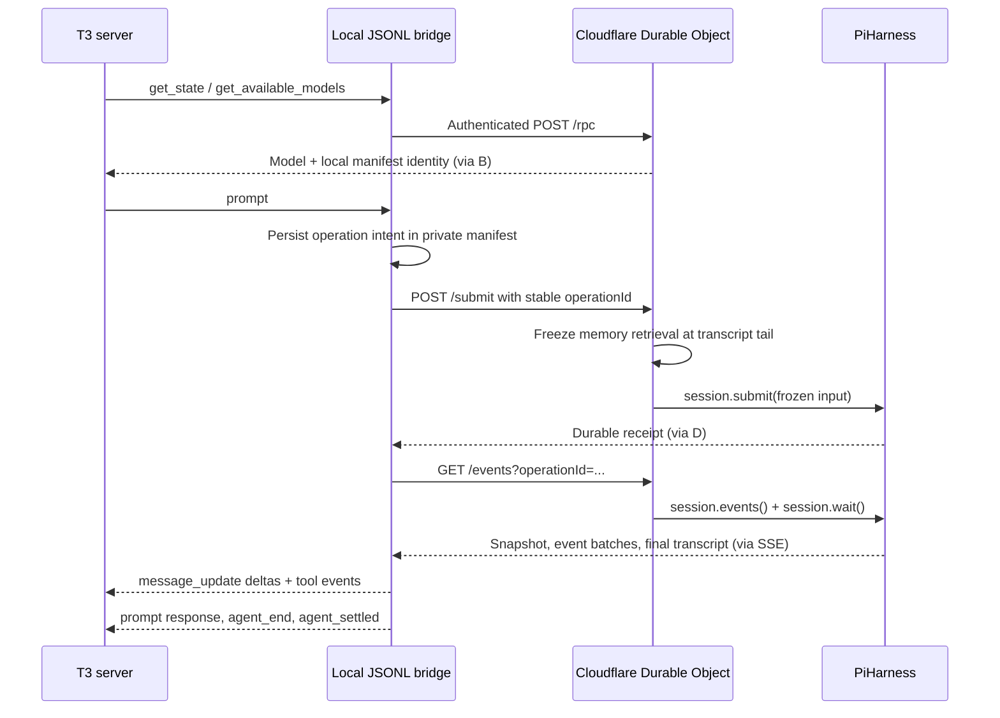

# T3 Code → Pi Durable

## What exists upstream (checked 2026-10-06)

Public GitHub code and T3 issue searches found no verified ready-made T3-to-Pi-Durable integration. This is a bounded search, not a claim that none exists privately. Search hits for `PiHarness` and T3 included another frontend's **local CLI** harness, not Cloudflare Pi Durable.

The source contracts used here are:

- [T3 PiAdapterV2](https://github.com/pingdotgg/t3code/blob/main/apps/server/src/orchestration-v2/Adapters/PiAdapterV2.ts): launches `pi --mode rpc`, records sessionFile as nativeThreadRef, streams deltas and settles at `agent_settled`.
- [T3 PiRpc](https://github.com/pingdotgg/t3code/blob/main/apps/server/src/orchestration-v2/Adapters/PiRpc.ts): correlated JSONL responses, id-less prompt acknowledgments, stdin/stdout.
- [T3 Pi provider](https://github.com/pingdotgg/t3code/blob/main/apps/server/src/provider/Layers/PiProvider.ts): version probe, model/command discovery.
- [Cloudflare official frontend](https://github.com/cloudflare/agents/tree/main/examples/next/harnesses/pi): `session.submit()` and `session.events()`, with application-owned transport.
- Installed public declarations: Agents 0.26.0, Pi Durable/Pi AI 1.0.2. The local T3 server is 0.0.46-nightly.20261003.2610. Compatibility is bounded to these contracts; beta API changes need renewed tests.

## Architecture and responsibilities



One private session manifest maps one T3 chat to one named Durable Object. The root Pi conversation is that object's chat; memory stays in the same object's `hm_*` tables. New chats get a random object name, so they do not share memory. An explicit new cache epoch within that object preserves its memory. Cross-chat shared memory is a separate future feature.

The manifest is **not a Pi CLI transcript file** and cannot be opened with ordinary Pi `/resume`. It holds endpoint, remote identity, optional title, and pending operation id/prompt hash/baseline entry ids. It contains no API token or prompt text. The remote Pi transcript is authoritative. `sessionFile` is a compatibility identity for T3's adapter, not a claim of Pi CLI session-file compatibility.

The remote transport uses SSE rather than the official example's WebSockets: HTTP authorization headers work directly from Node, snapshots repair interrupted observers, and each operation stream has an explicit ending. This can also support other frontends. It does not manipulate Pi's SQLite tables or run another model loop.

## Install on the machine running the T3 server

```bash
cd /path/to/durable-agent-memory
npm ci
npm run build:bridge
./bin/pi-durable --version
```

Create a private `~/.config/durable-agent-memory/bridge.json` (mode 0600):

```json
{
  "url": "https://durable-agent-memory.cloudflare-henry.workers.dev",
  "tokenFile": "/absolute/path/to/private/demo-token",
  "sessionsDir": "/absolute/path/to/private/bridge-sessions"
}
```

The token file contains the deployed demo bearer token, **not the Cloudflare API token**. Both config and token live outside Git. `PI_DURABLE_CONFIG` can select another private config. HTTPS is required except on localhost. Session manifests are restricted to the configured directory and matching endpoint.

In T3 Settings → Providers → Pi:

1. Enable Pi.
2. Set Binary path to the absolute path of `bin/pi-durable`.
3. Leave launch arguments empty.
4. Select **Pi default** or the one discovered Workers AI model for a chat.

The executable's version line explicitly identifies it as a bridge and reports the RPC compatibility baseline 0.80.5 for T3's minimum-version check. It is not the installed version of the ordinary Pi coding agent.

Chat with “Remember that my favourite database for small projects is SQLite”, then ask about that preference later. Inspect the resulting `t3-...` agent id with the existing debug UI/API. Restarting the bridge reuses the manifest. Retrying the identical prompt after a crash uses the saved operation id; a different prompt while the old operation runs fails explicitly. Ordinary successful repeated prompts get new operation ids.

## Supported and deliberately unsupported behavior

| Behavior | Status |
|---|---|
| Version probe; model and command discovery | Supported; one configured remote model; empty command catalog |
| Ordinary chat and live text/thinking projection | Supported; default deployment requests thinking off; provider output may still contain reasoning |
| `remember`, `recall`, `memory_expand` tool activity | Supported |
| Abort | Stops actual remote Pi work; disconnect alone does not |
| New/switch session; title; messages; entries; usage | Supported; linear projected entries, not native CLI branch files |
| Stream reconnect; final snapshot repair | Supported; same operation, no repeated prefix deltas |
| Process/Worker crash during a turn | Saved operation intent and Pi lifecycle recovery; tested locally |
| Model/thinking selection | Only the deployment's configured model; Pi thinking configuration is supported |
| Images, steer/follow-up during an active turn | Explicitly rejected in this bridge version |
| `/compact`, rollback, fork, branch navigation, export HTML | Explicitly rejected; use existing host reset/compaction API for cache epochs |
| Local CLI extensions, skills, auth/settings files | Not loaded remotely; injected extension produces a stderr notice |
| T3 MCP delegation, permission dialogs, local file/shell tools | Local host tools are not provided; remote workspace file tools are available; isolated JavaScript exec requires the Workers Paid configuration |
| T3 unattended `--no-tools` text generation | Prompt rejected; restrictions are never silently ignored |

T3's Pi driver advertises capabilities of the full CLI. A binary override cannot change those UI capabilities, so unsupported actions return a clear failed RPC response. A first-class remote T3 provider would be the cleaner long-term way to expose accurate capabilities and richer remote recovery. Do not treat this bridge as a complete remote coding workspace.

## Tests and recovery boundaries

```bash
npm run check
npm run test:bridge
BRIDGE_REMOTE_URL=https://YOUR-WORKER.workers.dev \
  BRIDGE_TOKEN_FILE=/path/to/private/token npm run test:bridge
```

The local integration runs the actual executable, Wrangler/workerd, SQLite DO and PiHarness with an explicitly scripted provider. It tests discovery, streaming, authentication, isolated chats, process resume, Worker restart, abort, and killing both observer and Worker mid-turn before retrying the same prompt. It verifies exactly one accepted user input and checks that a memory write leaves the transcript unchanged. Unit tests separately prove cache-friendly model-facing prefixes and reconnect delta deduplication. Remote smoke uses real Workers AI, invokes `remember`, checks the persisted event and observes the post-tool confirmation. Workers AI raw-return shapes are normalized at the public binding boundary (Response, SSE ReadableStream, or JSON) before the official Agents provider consumes them. This defensively protects the beta adapter's expected raw-Response contract when model return shapes vary.

An accepted operation is durable. Observation retries are bounded; after exhaustion the bridge fails the T3 turn and keeps its manifest intent so an identical retry can recover. If a process dies before a prompt reaches Cloudflare, retry is required; the bridge is not a background outbox daemon. There is no atomic acknowledgment across T3's database and the local manifest, so crashes around completion require inspecting/retrying the pending operation. Concurrent writers using one manifest are not supported; do not run two T3 sessions against the same manifest simultaneously. Other clients holding the shared token can still write to that object; production needs per-session admission/authorization.

## Remaining work for a full remote coding harness

The hosted JavaScript workspace is documented in [EXECUTION.md](EXECUTION.md). A full coding workspace still needs a separately designed execution boundary: authenticated filesystem/tool RPC to this machine or a Cloudflare Workspace/Sandbox, replay policies and operation deduplication, cancellation, permission enforcement, filesystem checkpoints and Git synchronization. Loading T3's local extension into a Worker is not a compatible substitute. Also add a first-class remote-provider capability profile, steering/follow-up, fork/rollback semantics, tenant authorization, spend/rate limits, bounded transcript pagination, concurrent-writer arbitration and beta-version contract CI. Live mid-generation Cloudflare eviction tests are still needed; local workerd recovery is not proof of every hosted failure mode.

## Verification in this environment

Configured the Pi provider on this T3 server with `/home/coder/workspaces/pi-durable-agent-cf/bin/pi-durable`. T3's live catalog discovered **Pi default** and **cloudflare/@cf/zai-org/glm-4.7-flash**. The executable completed chat and a real `remember` tool round against the deployed Worker. Local tests also killed both bridge and workerd during generation and proved one accepted user entry after resumption. The native T3 discovery path was verified; a chat created and driven through the T3 UI itself was not exercised because this server has no attached browser automation host.

Final verification: 27 unit/integration tests passed; typecheck and Worker dry-run passed; local executable/workerd crash and cancellation checks passed; live executable/Workers AI chat plus `remember` continuation passed. Sampled live logs contained 50 `ok` outcomes, no `pi_report`/`hm_request_failed` markers, and one recoverable summary retry. Beta-provider failures can still surface as an unanswered Pi operation; retained events and pending summaries are not discarded.

## Conversation continuity and empty recall

The active Pi transcript and the retained-event search are distinct. `recall` returns `{ scope: "retained_long_term_memory", results, guidance }`; an empty result does not mean a prior turn vanished or a factual claim is false. The system policy tells the model to inspect its active transcript for follow-ups, acknowledge its own earlier statements, and distinguish an unverified assistant suggestion from an established fact. There is no live web/business-listing tool in this harness.

The regression test captures actual model-request bodies from the official Agents provider after a recall returning no retained events, then reopens Pi SQLite and checks that the earlier assistant statement and latest user correction remain on the wire. The hosted continuity smoke uses an explicitly fictional venue, an empty recall, and a bridge restart; fictional suggestions must not become retained facts. These tests establish transcript continuity and sampled model behavior, not a guarantee of model factual accuracy.

Deploying a changed static instruction policy can intentionally begin a new prompt-prefix/cache epoch. It preserves existing Pi history and does not reset the user's conversation. Ordinary memory writes still leave the established prefix unchanged.
